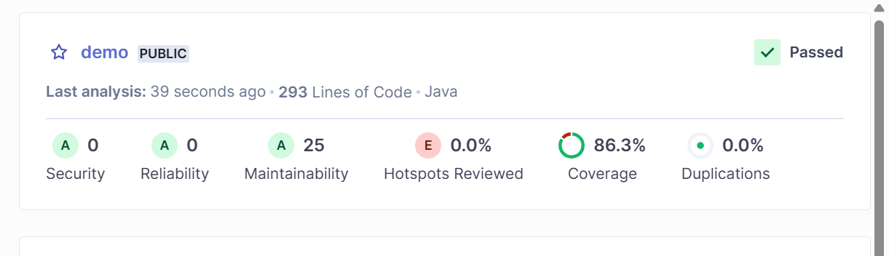
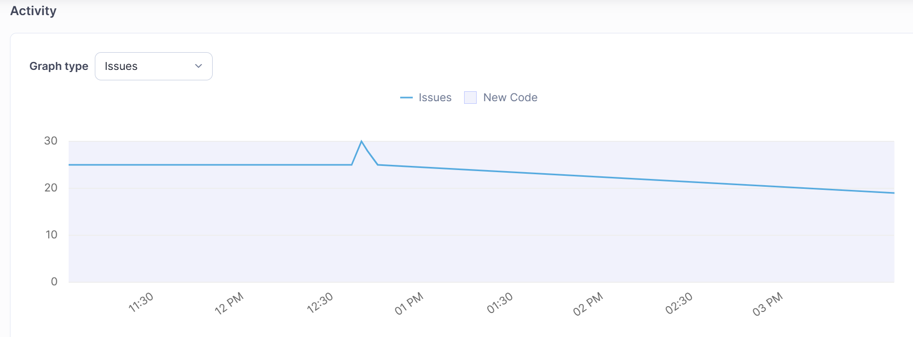

# DevOps 06 - Quality

## Lernjournal

### Lint Warnung erzeugen und beheben

ICh habe die Library installiert und dann durchlaufen lassen. Der Syntaxfehler wurde korrekt erkannt vom Linter.


### Erstellung Sonar Report und Dokumentieren

Ich habe gemäss Vorgabe das Image und den Container aufgesetzt mit Sonarqube.
Innerhalb von Sonarqube dann eine neues Projekt aufgesetzt. Für das Projekt den Token generieren lassen, mit welchem ich dann die Daten über den Build ins Sonarqube reinbringe.

Nachdem ich beide Projekte aufgesetzt hatte, sah es wie folgt aus:


Danach hatte ich im `build.gradle` File folgende Zeilen ergänzt. So entfiel das ergänzen der lästigen Argumente für den CMD.

```kts
sonar {
    properties {
        property "sonar.projectKey", "demo-backend"
        property "sonar.host.url", "http://localhost:9000"
        property "sonar.token", "sqp_7c395d4c08a44c760cdf07b95168093ea4844ad5"
		property "sonar.sources", "src/main/java"
        property "sonar.tests", "src/test/java/"
    }
}
```

Danach konnte ich mit dem einfachen CMD, die Analyse durchführen.

```bash
./gradlew sonar  
```

Danach habe ich fürs File `ToDoController.java` neue Tests ergänzt im File `ToDoControllerTest.java`.


```java
{
    @Test
    void testUpdateTodo() {
        var controller = new ToDoController();
        var todo = new ToDo(1, "Initial Title", "Initial Description");
        controller.createTodo(1, todo);
        var updatedTodo = new ToDo(1, "Updated Title", "Updated Description");
        controller.createTodo(1, updatedTodo);
        var result = controller.getTodo(1);
        assertEquals(1, result.getId());
        assertEquals("Updated Title", result.getTitle());
        assertEquals("Updated Description", result.getDescription());
    }

    @Test
    void testCount() {
        var controller = new ToDoController();
        assertEquals(0, controller.count());
        var todo1 = new ToDo(1, "Title 1", "Description 1");
        var todo2 = new ToDo(2, "Title 2", "Description 2");
        controller.createTodo(1, todo1);
        controller.createTodo(2, todo2);
        assertEquals(2, controller.count());
    }

    @Test
    void testTodoList() {
        var controller = new ToDoController();
        var todo1 = new ToDo(1, "Title 1", "Description 1");
        var todo2 = new ToDo(2, "Title 2", "Description 2");
        controller.createTodo(1, todo1);
        controller.createTodo(2, todo2);
        var result = controller.todo();
        assertEquals(2, result.size());
        assertTrue(result.stream().anyMatch(entry -> entry.getName().equals("Title 1")));
        assertTrue(result.stream().anyMatch(entry -> entry.getName().equals("Title 2")));
    }
}
```

Nachdem ich dann wieder über die Analyse mit Sonar gestartet hatte, sah ich dann eine Veränderung der Coverage: 



Die Coverage konnte auch über die Zeit verfolgt werden. Dies sah so aus:


In dieser Grafik sieht man auch, dass Issues enstanden durch einen Build (Implementation Test), aber wieder behoben wurden: 


Ich habe mir einige Issues angeschaut in Sonarqube und danach Issues im File `PathListEntryTest.java` entfernt. Und zwar habe ich alle `public`-Argumente, wie vorgeschlagen, entfernt. Danach wiederholt den Sonarqube-Report erzeugt mit folgendem Output:




### Selenium

Leider hats in meinem Anwendungsfall für Google Chrome keine validen Plugins gegeben und die Tests im Edge-Browser haben leider nicht funktioniert. Da ich auch schon Webspracping mit Selenium auf Python betrieben habe, habe ich Python Code für den Test implementiert.


